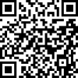

# 706 生活实验室沙发客规则和申请表

沙发客规则：

1. 申请入住
   1. 在入住一周前联系生活实验室协调员，提出申请。一周以内的申请需要介绍人，并且需要全体住客同意。
   2. 填写沙发客申请表，协调员收到申请表后，住客XX（人数）同意则可以入住，在48小时内回复是否可以提供沙发。
2. 入住收费
   1. XX元/晚，押金XX元。
   2. 706固定工作人员可以免费入住，免费天数最高X天。（再议）
   3. 根据入住天数计算费用，一次性交给生活实验室协调员。
3. 入住天数
   1. 单次入住不超过7天，超过7天要再次申请（连续申请也需要提前一周）。
   2. 最多可同时容纳X位沙发客。
4. 入住卫生、安全、行为和用电等细则

**参实验室内部规则**

1. 空间使用权
   1. 在没有住客的同意情况下，不随意进入住客的房间。
   2. 可以使用厨房和冰箱。请在使用生活实验室的锅碗前询问一下住客。
   3. 如果要带朋友来实验室，请提前告知协调员。不能带朋友在实验室的过夜。
   4. ......
2. 入住期间活动
   1. 沙发客可以免费参加入住期间在实验室客厅举办的活动。
   2. 沙发客可以在入住前或者入住期间策划一场自己的分享、工作坊等活动。举办活动需要向住客提出申请。

沙发客申请表：



备注：此处给出了上海生活实验室沙发客申请表，各个实验室可以将其作为模板，制定自己的沙发客申请表。

身份证：

你是如何了解到706的：

| 姓名： |  |
| :--- | :--- |
| 性别： |  |
| 你的毕业院校/在读院校（选填）： |  |
| 你就读的专业、辅修的学科： |  |
| 你的工作、领域： |  |
| 你有什么突出的兴趣爱好： |  |
| 简单罗列一下你的重要经历： |  |
| 你的推荐人： |  |
| 能看清正脸的生活照： |  |
| 你计划的入住时间： |  |
| 你来XX的原因： |  |

